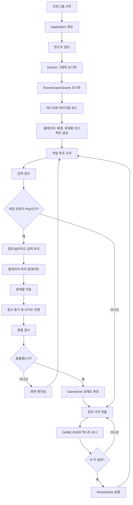
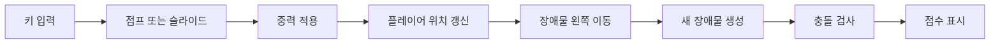
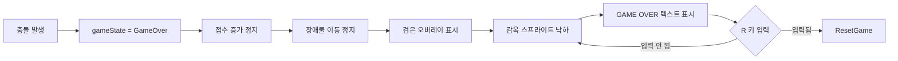
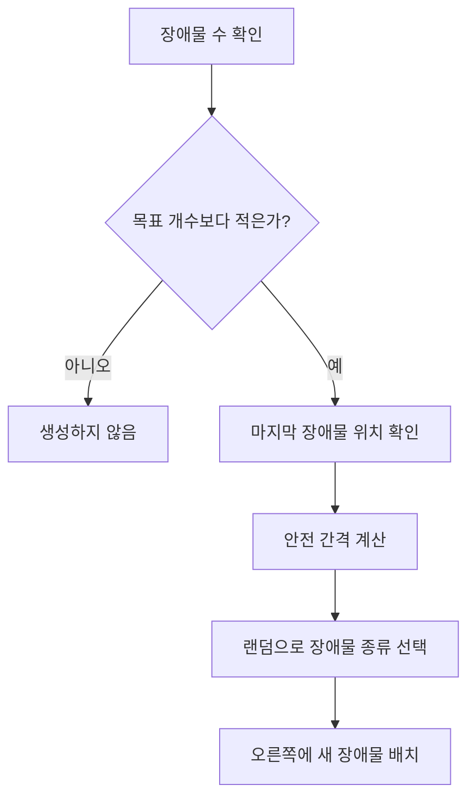

# 01. 게임 전체 흐름도

이 문서는 CrimsonRunner가 시작되고, 플레이되고, 게임오버가 되며, 다시 시작되는 전체 흐름을 설명합니다.

## 한 문장 요약

게임은 매 프레임마다 입력을 읽고, 플레이어와 장애물을 움직이고, 충돌 여부를 확인한 뒤, 화면을 다시 그리는 방식으로 작동합니다.

## 전체 흐름도

## 프레임 단위 동작

게임은 보통 1초에 여러 번 화면을 갱신합니다. 한 번의 화면 갱신을 프레임이라고 부릅니다. CrimsonRunner의 한 프레임은 다음 순서로 진행됩니다.

1. 키보드 입력을 확인합니다.
2. 현재 게임 상태가 플레이 중인지 게임오버인지 확인합니다.
3. 플레이 중이면 플레이어와 장애물을 움직입니다.
4. 플레이어와 장애물이 겹쳤는지 확인합니다.
5. 겹쳤다면 게임오버 상태로 바꿉니다.
6. 모든 오브젝트를 화면에 그립니다.
7. 점수 또는 게임오버 문구를 화면에 표시합니다.

## 게임 상태

CrimsonRunner에는 두 가지 큰 상태가 있습니다.

| 상태 | 의미 |
|---|---|
| `Play` | 게임이 진행 중인 상태입니다. 점수 증가, 장애물 이동, 충돌 검사가 이루어집니다. |
| `GameOver` | 충돌 후 게임이 멈춘 상태입니다. 감옥이 떨어지고 `R` 키로만 재시작할 수 있습니다. |

## 플레이 중 흐름

## 게임오버 흐름

## 점수와 배경 전환

점수는 시간이 지나면서 자동으로 올라갑니다. 점수가 일정 기준을 넘으면 배경이 낮/밤으로 바뀝니다.

- `score / 1000 % 2 == 0`: 낮 배경
- `score / 1000 % 2 == 1`: 밤 배경

즉, 1000점 단위로 낮과 밤이 번갈아 나타납니다.

## 장애물 생성 흐름

장애물은 화면 오른쪽에서 생성되고 왼쪽으로 이동합니다. 화면 밖으로 나가면 제거됩니다.

## 충돌 검사 흐름

충돌 검사는 아주 단순하게 말하면 두 사각형이 겹치는지 확인하는 방식입니다.

- 플레이어 충돌 박스
- 장애물 충돌 박스

두 박스가 가로와 세로 모두 겹치면 충돌로 판단합니다.

## 왜 보이는 크기와 충돌 크기를 분리했는가

픽셀아트 이미지는 투명 여백, 장식, 그림자 같은 부분이 있습니다. 이 전체를 충돌 판정에 쓰면 플레이어가 실제로 닿지 않은 것처럼 보여도 죽을 수 있습니다. 그래서 CrimsonRunner는 다음을 분리합니다.

- 보이는 크기: 화면에 그려지는 스프라이트 크기
- 충돌 크기: 실제로 죽는 판정에 쓰이는 작은 사각형

이렇게 하면 게임이 더 공정하게 느껴집니다.
