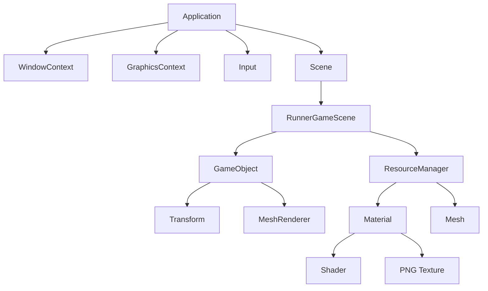
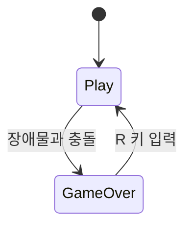

# 02. 설계도 및 구조

이 문서는 CrimsonRunner의 전체 설계를 설명합니다.

## 프로젝트 구조

```text
CrimsonRunner/
├─ CrimsonRunner.slnx
├─ CrimsonRunner.vcxproj
├─ Shaders/
│  └─ BasicColor.hlsl
├─ Textures/
│  ├─ SpriteSheet_Player.png
│  ├─ Background_Prison_Day.png
│  ├─ Background_Prison_Night.png
│  ├─ Ground_Prison_Run.png
│  ├─ Obstacle_Police.png
│  ├─ Obstacle_Dog.png
│  ├─ Obstacle_Wall.png
│  ├─ Obstacle_UpperWall.png
│  └─ GameOver_JailCage.png
├─ src/
│  ├─ Core/
│  ├─ Graphics/
│  ├─ Input/
│  ├─ Object/
│  ├─ Physics/
│  ├─ Resources/
│  ├─ Scene/
│  └─ Game/
└─ docs/
```

## 폴더별 역할

| 폴더 | 역할 |
|---|---|
| `src/Core` | 프로그램 실행, 시간 계산, 윈도우 관리를 담당합니다. |
| `src/Graphics` | DirectX 렌더링, 머티리얼, 메시, 셰이더를 담당합니다. |
| `src/Input` | 키보드 입력 상태를 관리합니다. |
| `src/Object` | 게임 오브젝트와 컴포넌트 구조를 제공합니다. |
| `src/Scene` | 씬의 기본 틀을 제공합니다. |
| `src/Game` | 실제 게임 규칙과 플레이 흐름이 들어 있습니다. |
| `src/Resources` | 메시, 머티리얼, 텍스처 로딩을 담당합니다. |
| `Shaders` | GPU에서 실행되는 HLSL 셰이더 코드가 있습니다. |
| `Textures` | 게임에서 사용하는 PNG 이미지 에셋이 있습니다. |

## 전체 설계 개요

CrimsonRunner는 작은 게임 엔진 구조 위에 러닝 게임 씬을 얹은 형태입니다.



## 렌더링 설계

화면에 무언가를 그리려면 다음 요소가 필요합니다.

1. `GameObject`: 화면에 존재하는 대상입니다.
2. `Transform`: 위치와 크기 정보입니다.
3. `MeshRenderer`: 실제로 그리는 컴포넌트입니다.
4. `Mesh`: 사각형 같은 기본 모양입니다.
5. `Material`: 색 또는 텍스처 정보를 가집니다.
6. `Shader`: GPU에서 최종 색을 계산합니다.

CrimsonRunner의 대부분 이미지는 사각형 메시 위에 PNG 텍스처를 입혀서 표시합니다.

## 게임 씬 설계

`RunnerGameScene`은 다음 역할을 모두 맡습니다.

- 배경 생성
- 플레이어 생성
- 장애물 생성
- 점수 계산
- 점프/슬라이드 처리
- 충돌 판정
- 게임오버 처리
- 감옥 낙하 연출

현재는 작은 게임이라 한 파일에 모여 있지만, 게임이 커지면 다음처럼 분리하는 것이 좋습니다.

| 현재 위치 | 나중에 분리할 수 있는 구조 |
|---|---|
| `RunnerGameScene`의 플레이어 코드 | `PlayerController` |
| `RunnerGameScene`의 장애물 코드 | `ObstacleSpawner` |
| `RunnerGameScene`의 게임오버 코드 | `GameOverController` |
| `RunnerGameScene`의 점수 코드 | `ScoreSystem` |

## 에셋 설계

| 에셋 | 용도 |
|---|---|
| `SpriteSheet_Player.png` | 플레이어 달리기, 점프, 슬라이드 애니메이션 |
| `Background_Prison_Day.png` | 낮 교도소 배경 |
| `Background_Prison_Night.png` | 밤 교도소 배경 |
| `Ground_Prison_Run.png` | 실제 발판처럼 보이는 바닥 이미지 |
| `Obstacle_Police.png` | 경찰 장애물 |
| `Obstacle_Dog.png` | 개 장애물 |
| `Obstacle_Wall.png` | 지상 벽 장애물 |
| `Obstacle_UpperWall.png` | 슬라이드로 피하는 위쪽 벽 |
| `GameOver_JailCage.png` | 게임오버 감옥 연출 |

## 입력 설계

입력은 `Input` 클래스가 한 프레임 전 상태와 현재 상태를 비교해서 판단합니다.

- 지금 눌려 있는가: `IsKeyDown`
- 이번 프레임에 눌렸는가: `WasKeyPressed`
- 이번 프레임에 떼었는가: `WasKeyReleased`

이 구조 덕분에 점프처럼 “한 번 누르는 입력”과 슬라이드처럼 “누르고 있는 입력”을 구분할 수 있습니다.

## 게임 상태 설계



`Play` 상태에서는 점수와 장애물이 움직입니다. `GameOver` 상태에서는 플레이가 멈추고 재시작 입력만 받습니다.

## 충돌 설계

충돌은 AABB 방식입니다. AABB는 축에 평행한 사각형 충돌 박스입니다.

```text
플레이어 박스와 장애물 박스가
가로로 겹치고
세로로도 겹치면
충돌입니다.
```

장점은 계산이 매우 빠르고 이해하기 쉽다는 점입니다. 단점은 둥근 모양이나 복잡한 모양에는 정밀하지 않다는 점입니다.

## 그래픽 품질 설계

픽셀아트가 흐릿해지지 않도록 `Material.cpp`에서 텍스처 필터를 `POINT`로 설정했습니다.

```cpp
samplerDesc.Filter = D3D11_FILTER_MIN_MAG_MIP_POINT;
```

이 설정은 확대/축소 시 픽셀을 부드럽게 섞지 않고 또렷하게 유지합니다.
