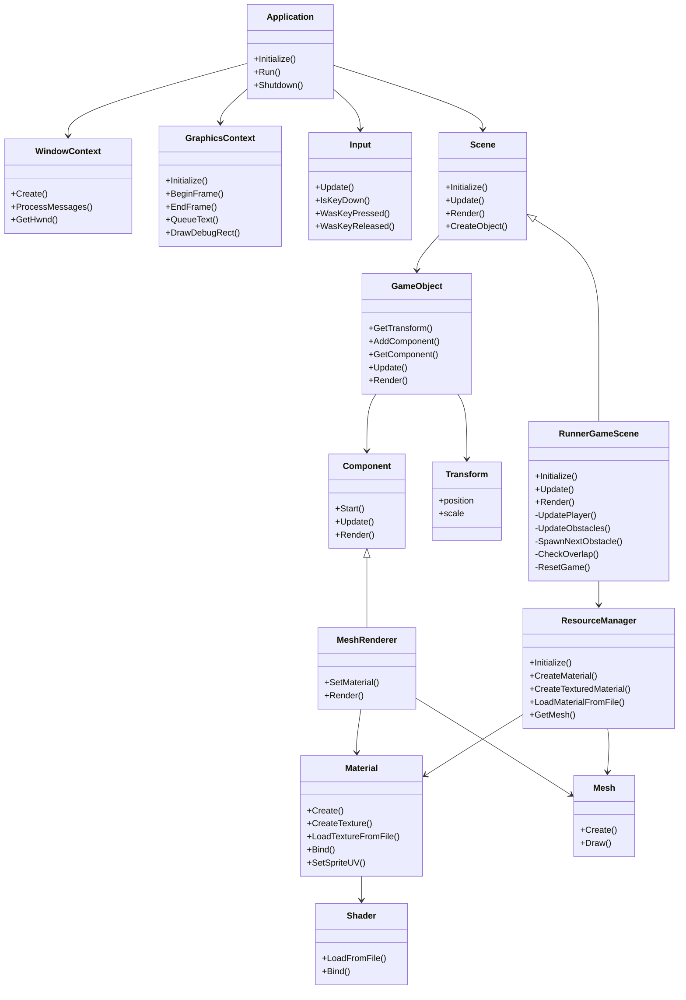
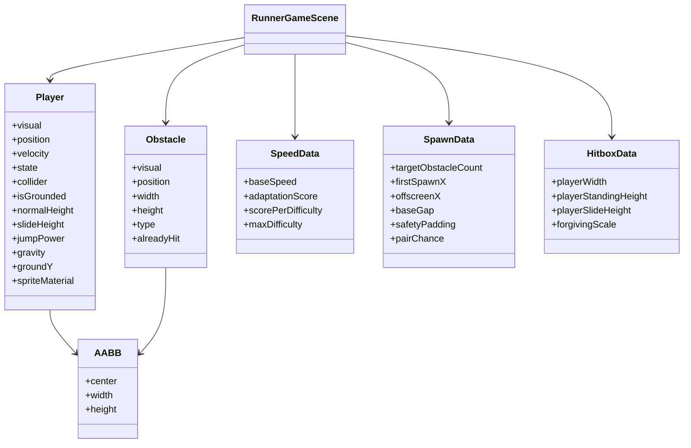

# 03. 클래스 다이어그램

이 문서는 CrimsonRunner의 주요 클래스와 구조체 관계를 설명합니다.

## 주요 클래스 다이어그램

## 게임 데이터 구조체 다이어그램

## 클래스별 쉬운 설명

### Application

게임 전체를 실행하는 관리자입니다. 창을 만들고, 그래픽을 준비하고, 매 프레임마다 입력/업데이트/렌더링을 반복합니다.

### WindowContext

Windows 운영체제의 창을 담당합니다. 게임 화면이 표시되는 창을 만들고, 창 닫기 같은 메시지를 처리합니다.

### GraphicsContext

DirectX를 이용해 화면을 그리는 클래스입니다. 화면을 지우고, 사각형이나 텍스트를 그리고, 마지막에 화면을 표시합니다.

### Input

키보드 입력을 기억합니다. 지금 눌린 키, 방금 눌린 키, 방금 뗀 키를 구분합니다.

### Scene

게임 장면의 기본 틀입니다. 여러 `GameObject`를 가지고 있고, 이 오브젝트들을 업데이트하고 렌더링합니다.

### RunnerGameScene

CrimsonRunner의 실제 게임 규칙이 들어 있는 핵심 클래스입니다. 플레이어, 장애물, 점수, 게임오버를 모두 관리합니다.

### GameObject

화면에 존재하는 하나의 물체입니다. 플레이어, 배경, 바닥, 장애물, 감옥 모두 GameObject입니다.

### Transform

물체의 위치와 크기입니다. 예를 들어 플레이어가 어디에 있고 얼마나 크게 보일지를 정합니다.

### Component

GameObject에 붙는 기능 조각입니다. 현재는 화면에 그리는 `MeshRenderer`가 대표적입니다.

### MeshRenderer

GameObject를 실제로 화면에 그리는 컴포넌트입니다. 사각형 Mesh와 Material을 이용합니다.

### ResourceManager

게임에서 쓰는 Mesh와 Material을 만들고 보관합니다. PNG 파일을 Material로 로드하는 일도 담당합니다.

### Material

물체의 색과 텍스처 정보를 담습니다. PNG 이미지를 불러와서 화면에 표시할 수 있게 합니다.

### Mesh

그릴 기본 모양입니다. CrimsonRunner는 대부분 사각형 Quad Mesh를 사용합니다.

### Shader

GPU에서 픽셀 색을 계산하는 코드입니다. 텍스처와 색상을 조합해 최종 화면 색을 만듭니다.
