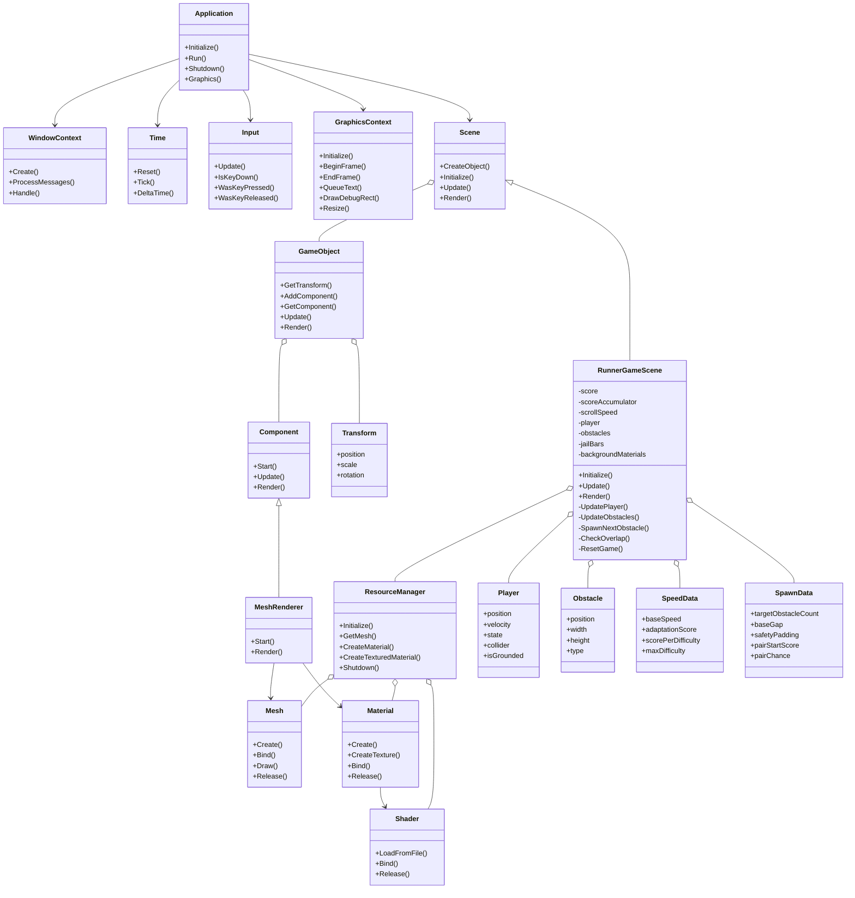

# RunnerEngine 클래스 다이어그램 최종본

## 설명

이 다이어그램은 실제 코드에 존재하는 주요 클래스와 `RunnerGameScene` 내부에서 사용하는 주요 구조체를 보여준다.

`Application`은 전체 실행 흐름을 관리한다. `WindowContext`, `Time`, `Input`, `GraphicsContext`, `Scene`을 연결해서 게임 루프를 실행한다.

`Scene`은 여러 `GameObject`를 가진다. `RunnerGameScene`은 `Scene`을 상속해서 실제 탈옥 런게임 규칙을 구현한다.

`GameObject`는 `Transform`과 `Component`를 가진다. `MeshRenderer`는 `Component`를 상속하며, `Mesh`와 `Material`을 사용해 화면에 오브젝트를 그린다.

`ResourceManager`는 `Shader`, `Mesh`, `Material`을 생성하고 보관한다.

`Player`, `Obstacle`, `SpeedData`, `SpawnData`는 별도 시스템 클래스가 아니라 `RunnerGameScene` 안에서 게임 상태와 밸런스 값을 정리하기 위한 단순 구조체다.
