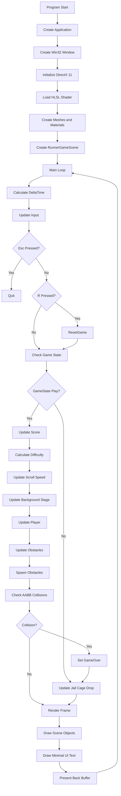

# RunnerEngine 흐름도 최종본

## 설명

이 흐름도는 프로그램 시작부터 게임 루프, 게임오버, 재시작까지의 실제 실행 순서를 보여준다.

프로그램이 시작되면 Win32 창을 만들고 DirectX 11을 초기화한다. 이후 HLSL 셰이더와 렌더링 리소스를 만들고 `RunnerGameScene`을 생성한다.

메인 루프에서는 매 프레임 `DeltaTime`을 계산하고 키보드 입력을 갱신한다. `Esc`를 누르면 종료하고, `R`을 누르면 `ResetGame()`으로 게임 상태를 초기화한다.

게임이 `Play` 상태이면 점수, 난이도, 배경, 플레이어, 장애물, 충돌 판정을 처리한다. 충돌이 발생하면 `GameOver` 상태가 된다.

게임오버 상태에서는 점수와 난이도 증가가 멈추고 감옥 창살 하강 연출만 갱신된다. 이후 화면을 렌더링하고 백버퍼를 표시한다.
